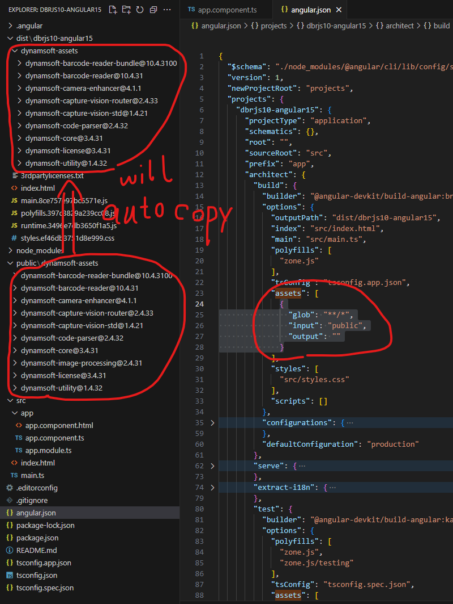

### About redirect \*.html

When deploying a single-page application, `*.html` is often redirected to `index.html`.

To avoid affecting the loading of `dce.ui.html`, you can rename it to `dce.ui.html.xml`.

Then in your code, you can load it like this:
```ts
let cameraView = await CameraView.createInstance('dynamsoft-assets/dynamsoft-camera-enhancer@4.1.1/dist/dce.ui.html.xml');
```

### About wasm mimetype

If you are using older or stripped down nginx it may not give the mimetype for `*.wasm`.

dockerfile:
```dockerfile
RUN printf "\ntypes {\n\tapplication/wasm\twasm;\n}\n" >> /etc/nginx/mime.types
```

### Config public folder

I do not put dynamsoft-assets in this project, since it's too big.

You can download dynamsoft-assets from [the link](https://www.dynamsoft.com/barcode-reader/downloads/?ver=10.4.31&utm_source=guide&product=dbr&package=js) and put resources into `public` yourself.


